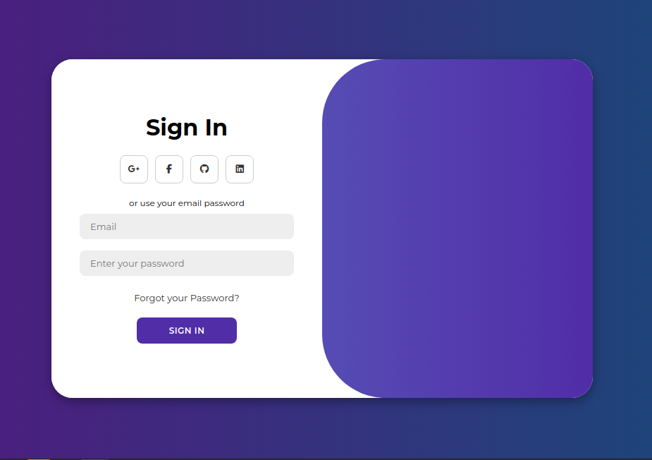
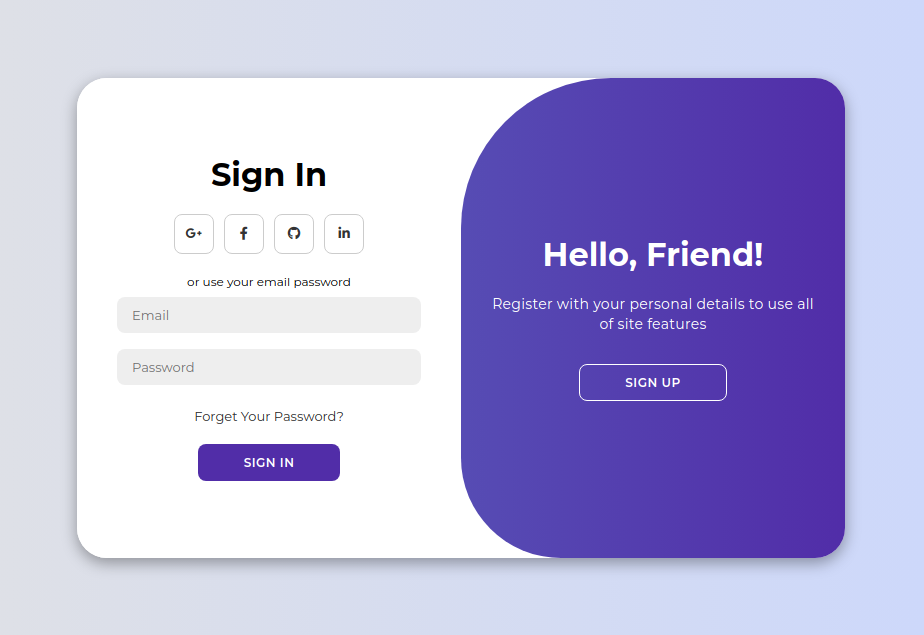

# Modern Animated Login Form

Lets create a complete Login form design with Login, Sign up animations and basic JS events. We'll be using CSS Flexbox and CSS transition for some animation effects.

## Branches dev1, dev2, dev3 and Joint
These Branches contain the same changes and look as follow:
>


## Branch Testing
Some errors related to the toggle section and responsiveness of the utility were fixed in this branch:
>


## Branches QA and Main
There will be always an opportunity to improve the final outcome by applying different styles as happened in these two merged branches making its appearance more engaging:
>


  

#  Code analysis

##  HTML File

###  Summary:
The login form structured in this practice is composed mainly of three  containers classes; one of them is a simple **sign in form** with some required fields for the user to get into the web resource, the second one is a **form** too, but **for registration**, which follows a similar structure  with just one more field for the name input. The third grouped element or container is a **big toggle** that was placed on top of the other two containers that **give the sense of being an animated slider**.

###  Code:
We start by defining a main div tag with the class _**container**_ under which all the elements will be placed.

As mentioned in the summary we continue by defining the classes **_form-container sign-up_**, **_form-container sign-in_** and the **_toggle-container_**  one.

- **_form-container sign-up_**
> Inside this container from top to down we placed first a title using the 	**_h1_** tag, a group  of social media icons encapsulated in the **_social-icons_** div class, a text for registration using the **_span_** tag, three **_input_** fields and lastly a **_button_** tag for the sign up action.
> 
- **_form-container sign-in_**
>This container follows a similar structure of the previous one, but in this case we **_removed an input_** field and added a hyperlink using the **_href_** tag aimed to redirect the user toward other page that reestablish the password.
>
- **_toggle-container_**
> To recreate the animated effect we placed a big toggle in front of the forms with the class **_toggle_** which is divided itself in two parts, the **_toggle-panel toggle-left_** and the **_toggle-panel toggle-right_** classes, both of them following the same structure; a title using the **_h1_** tag, a brief text using the **_p_** tag and a **_button_** with same class **_hidden_** that will allows us to make some effects possible through the style code and the script.
 

##  CSS File

###  Code:

-  **Importing Google family font**
>
```css
@import url('https://fonts.googleapis.com/css2?family=Montserrat:wght@300;400;500;600;700&display=swap');
```
>This line imports the Poppins font from Google Fonts. The **@import** rule is used to include external stylesheets. In this case, the stylesheet is hosted on Google Fonts and the font being imported is Poppins with different weights (300, 400, 500, 600). The **url() function** is used to specify the location of the external stylesheet. 
***
***
-  **Global styles using the _asterisc_ * selector**
>
```css
*{
}
```
> This selector targets all elements on the page and sets their margin, padding, and box-sizing properties.
***
***
-  **The _Body_ selector**
```css
body{
}
```
> Using the **body** element we created a full-screen background with a gradient that transitions from dark blue to dark blue-purple, and centring its content both horizontally and vertically using the flexbox layout.
***
 ***
-  **Styling elements inside the main container**
```css
.container{
}
```
> This code styles the main container element with a white background, rounded corners, a drop shadow, and a fixed width and minimum height. The element will also clip any overflowing content and will not exceed the width of its parent element.
***
```css
.container h1{
}
```
> By using the **_h1_** tag, all the titles inside the main container class will get this style applied.
***
```css
.container p{
}
```
> Similarly by using the **_p_** tag, all the paragraph elements inside the main container class will get this style applied.
***
```css
.container span{
}
```
> This tag selector targets any HTML  _**span**_ elements that are descendants of the elements with the class _**container**_. This is useful you want to apply a different font style to a specific section of text.
***
```css
.container a{
}
```
> This CSS rule styles anchor elements within an element with the class _**container**_ to have a dark gray color, a font size of 13 pixels, no text decoration, and a margin of 15 pixels on top, 0 pixels on the sides, and 10 pixels on the bottom.
***
```css
.container button{
}
```
> This selector styles buttons inside the class _**container**_. It sets the button's background color, text color, font size, padding, border, and other visual properties to create a specific design. The _**cursor: pointer**_ property changes the mouse cursor to a pointing hand when hovering over the button, indicating it's a clickable element.
***
```css
.container button.hidden{
}
```
> Here we target the button element with the _**hidden**_ class, which inside the main _**container**_ class. It sets the button's background color to transparent and its border color to white (#fff), effectively giving the invisible effect to our button.
***
```css
.container form{
}
```
> Here we style the _**form**_ element within the _**main container**_. It sets the form's background color to white (#fff), centers its content both horizontally and vertically using _**flexbox**_, and adds _**padding**_ to the left and right sides taking up the full height of its _**parent container**_.
***
```css
container input{
}
```
> This code snippet styles the _**input**_ elements inside the _**main container**_. It sets the background color to a light blue (#eae1ff), removes the default border, adds some margin and padding, sets the font size to 13px, rounds the corners of the input with a border radius of 8px, makes the input take up 100% of the width of its container, and removes the default outline when the input is focused.
***
***
-  **Styling the form**
```css
.form-container{
}
```
> This block of code styles the form container to take up the full height of its _**parent form element**_, positioning it at the top, and adding a smooth transition effect to any changes made to the element's properties.
***
```css
.form-container form h1{
}
```
> Here we styles the title element inside the _**form container**_ to have a large font size, a purple color, and a vertical offset of -25 pixels, which moves it upwards from its normal position.
***
***
-  **Styling the sign-in and sign-up**
>
```css
.sign-in{
}

.container.active .sign-in{
}
```
> This CSS code snippet styles the element with the class _**sign-in**_ and its behavior when its parent element has the class _**active**_ .
> Once the parent element has the class _**active**_, the _**.sign-in**_ element will be _**translated 100% to the right**_, effectively hiding it from view. 

> When the parent element does not have the class _**active**_, the _**.sign-in**_ element will be positioned at the left edge of its parent element with a width of 50% and a z-index of 2.
***
>
```css
.sign-up{
}

.container.active .sign-up{
}
```
> Through this block of code we define a hidden _**.sign-up**_ element that will slide into view from the left when its parent container has the class _**active**_.
>  The animation will run for 0.6 seconds, and the element will be fully visible and on top of other elements when the animation is complete.
***
***
-  **The keyframe animation**
>
```css
@keyframes move{
}
```
> This CSS code defines a **_keyframe_ animation** named _**move**_. The animation controls the opacity and _**z-index**_ of an element over time and this is how it works.

> 1. At the start of the animation (0%), the element is fully transparent (opacity: 0) and has a low z-index (1).
> 2.  The element remains transparent and behind other elements until just before the halfway mark (49.99%).
> 3.  At the midpoint (50%), the element suddenly becomes fully opaque (opacity: 1) and jumps to the top of the stacking order with a higher z-index (5).
> 4.  The element remains opaque and on top until the end of the animation (100%).
***
***
-  **Styling the social media icons**
>
```css
.social-icons{
}

.social-icons  a{
}

.social-icons  .icon{
}

.social-icons  .icon  .fa-brands{
}
```
> These blocks of code style a group of social media icons with a purple border, rounded shape, and centered content. The icons are displayed horizontally with some space between them, and the Font Awesome icons are sized to 25 pixels.
***
***
-  **Applying CSS effects to our Toggle**
```css
.toggle-container{
}

.container.active  .toggle-container{
}
```
> This code styles a toggle container element that can be toggled on and off by adding or removing the _**active**_ class from its parent container. When the container is active, the _**toggle container will slide out**_ of view and change its border radius to create a curved corner effect.
***
```css
.toggle{
}

.container.active  .toggle{
}
```
> This code creates a toggle element that _**is initially hidden to the left**_ of its parent container. When the parent container is given the class _**active**_, the toggle element _**slides to the right, revealing itself**_. The transition effect is smooth and takes 1.1 seconds to complete.
***
```css
.toggle-pannel{
}
```
> This code defines a class that creates a flexible container that is absolutely positioned, centered, and takes up 50% of its parent's width and 100% of its parent's height. The container has a padding of 30px on the left and right, and any text within it will be centered. The element will also have a smooth transition effect when its properties change.
***
```css
.toggle-left{
}

.container.active  .toggle-left{
}

.toggle-right{
}

.container.active  .toggle-right{
}
```
> This code is used to create the slide effect, where elements with _**.toggle-left**_ and _**.toggle-right**_ classes are moved in and out of view when the container has the _**active**_ class. 
> The _**.toggle-left**_ elements start off-screen to the left and _**move into view**_ when the container _**is active**_, while the _**.toggle-right**_ elements start on-screen at the right edge and move off-screen to the right when the container is active.
***
***

##  JS File

###  Code:

- **Declaring constants**
>
```js
const container = document.getElementById('container');
const registerBtn = document.getElementById('register');
const loginBtn = document.getElementById('login');
```
> This code selects three HTML elements with IDs _**container**_, _**register**_, and _**login**_, and stores them in three separate constant variables: _**container**_, _**registerBtn**_, and _**loginBtn**_.
> 
>  These variables are then ready to be used when manipulating these elements in the next section of code.
***
***
- **Defining actions on click events**
>
```js
registerBtn.addEventListener('click', () => {
    container.classList.add("active");
});

loginBtn.addEventListener('click', () => {
    container.classList.remove("active");
```
> This JavaScript code adds event listeners to two buttons, `registerBtn` and `loginBtn`, to toggle a CSS class `active` on a container element.
> 
>These action are essentials when styling the registration form or container when the user clicks on the register or login buttons. When the register _**button is clicked**_, the _**container becomes "active"**_ , and when the _**login button is clicked**_, the _**container becomes "inactive"**_ (e.g., hidden or normal).

***
***


***